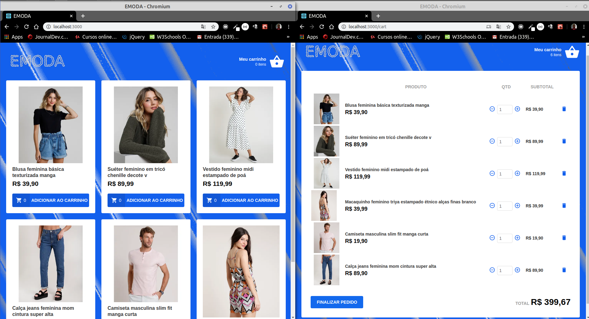

<html>
  <h1></h1>

Este é um projeto que representa uma loja virtual, simulando um carrinho de compra
projeto criado em ReactJS.

<h2>Tecnologias usadas:</h2>
<ul>
<li>#ReactJS -> para construção das templates</li>

<li>#JSON-SERVER -> para simular uma API</li>

<li>#Redux e React-Redux</li>

<li>#Styled-Component -> para trabalhar a estilização do CSS</li>

<li>#IMMER -> para poder fazer alterações no state do React sem quebrar o conceito de imutabilidade do state</li>

<li>#Axios -> para comunicação HTTP</li>

<li>#Polished -> para trabalhar com algumas propriedades do CSS.</li>
</ul>

</html>
